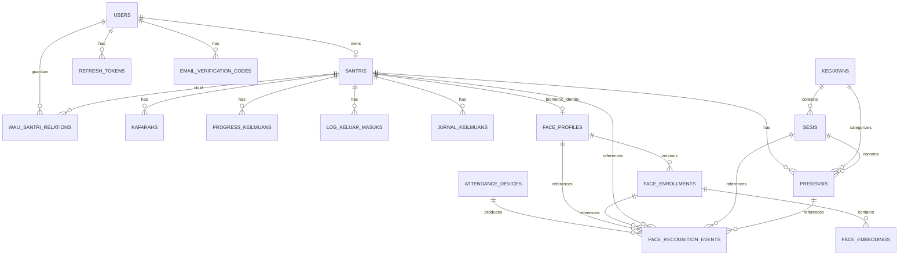

# KH2 Management System — Canonical Database Schema

> **Source of truth** untuk hardening database backend KH2, terutama Face Recognition.
>
> Repo: `ppmkh2sby/Backend_KH2-Management-System`
>
> Target branch: `agent/face-attendance-deployment`

## 1. Prinsip utama

1. Satu business concept hanya boleh mempunyai **satu source of truth**.
2. Jangan menyimpan dua indikator status aktif untuk objek yang sama.
3. `Sesis` adalah sumber kebenaran sesi presensi.
4. `Presensis` adalah sumber kebenaran kehadiran.
5. Face Recognition hanya menentukan identitas; ASP.NET tetap memegang business rule presensi.
6. Embedding biometrik hanya boleh berada di backend/database dan tidak pernah dikirim ke frontend.
7. Legacy compatibility tidak boleh menjadi sistem database kedua yang permanen.
8. Migration tidak boleh mengubah arti sebuah ID hanya dengan rename column.
9. Re-enrollment harus atomic dan dapat rollback.
10. Menambah Santri baru tidak memerlukan training ulang YOLO/ArcFace.

## 2. Canonical ERD



## 3. Existing core schema

### Users
```text
Id                  uuid PK
Username            UNIQUE
FullName
Email               UNIQUE NULL
Role
PasswordHash
EmailConfirmed
IsActive
MustChangePassword
CreatedAtUtc
UpdatedAtUtc        NULL
```

### Santris
```text
Id                  uuid PK
UserId              uuid FK -> Users.Id UNIQUE
FullName
Nis                 UNIQUE
Kampus
Jurusan
Gender
Tim
Kelas
Catatan             NULL
CreatedAtUtc
UpdatedAtUtc        NULL
```

Face Recognition harus mengacu ke `Santris.Id`, bukan langsung ke `Users.Id`.

### WaliSantriRelations
```text
Id
WaliUserId          FK -> Users.Id
SantriId            FK -> Santris.Id
RelationshipLabel
CreatedAtUtc
UpdatedAtUtc
UNIQUE(WaliUserId, SantriId)
```

### Kegiatans
```text
Id
Kategori
Waktu
Catatan
CreatedAtUtc
UpdatedAtUtc
UNIQUE(Kategori, Waktu)
```

### Sesis
```text
Id
KegiatanId          FK -> Kegiatans.Id
Tanggal
Catatan
CreatedAtUtc
UpdatedAtUtc
```

`Sesis` adalah satu-satunya session model operasional.

### Presensis
```text
Id
SantriId            FK -> Santris.Id
Nama
Status
KegiatanId          FK -> Kegiatans.Id
SesiId              FK -> Sesis.Id NULL
Catatan             NULL
Waktu
Source
CreatedAtUtc
UpdatedAtUtc
```

`Source`:
```text
Manual
FaceRecognition
Import
```

Jika business rule memastikan satu Santri hanya boleh satu Presensi per Sesi:

```text
UNIQUE(SesiId, SantriId)
WHERE SesiId IS NOT NULL
```

Sebelum membuat constraint tersebut, wajib cek duplicate:

```sql
SELECT "SesiId", "SantriId", COUNT(*)
FROM "Presensis"
WHERE "SesiId" IS NOT NULL
GROUP BY "SesiId", "SantriId"
HAVING COUNT(*) > 1;
```

Tabel existing lain yang tetap dipertahankan sesuai fungsi masing-masing:
- `refresh_tokens`
- `EmailVerificationCodes`
- `Kafarahs`
- `ProgressKeilmuans`
- `LogKeluarMasuks`
- `JurnalKeilmuans`
- `QuranSurahs`

---

# 4. Canonical Face Recognition tables

Hanya lima tabel berikut yang menjadi schema operasional Face Recognition:

```text
FaceProfiles
FaceEnrollments
FaceEmbeddings
AttendanceDevices
FaceRecognitionEvents
```

## 4.1 FaceProfiles

Satu identitas biometrik per Santri.

```text
FaceProfiles
- Id                  uuid PK
- SantriId            uuid FK -> Santris.Id UNIQUE
- Status              varchar(30)
- LastVerifiedAtUtc   timestamptz NULL
- CreatedAtUtc        timestamptz
- UpdatedAtUtc        timestamptz NULL
```

Status:
```text
Pending
Active
Disabled
NeedsReEnrollment
```

Relationship:
```text
Santri 1 -> 0..1 FaceProfile
```

### Jangan simpan `CurrentEnrollmentId`

`FaceProfiles.CurrentEnrollmentId` harus dihilangkan dari target canonical schema karena active enrollment sudah diwakili oleh:

```text
FaceEnrollments.Status = Active
```

Keduanya sekaligus akan menciptakan dua source of truth.

---

## 4.2 FaceEnrollments

Satu record mewakili satu generasi enrollment/re-enrollment lengkap.

```text
FaceEnrollments
- Id                  uuid PK
- FaceProfileId       uuid FK -> FaceProfiles.Id
- Status              varchar(30)
- ModelName           varchar(100)
- ModelVersion        varchar(100)
- ReferenceImagePath  varchar(500) NULL
- EnrolledAtUtc       timestamptz
- ActivatedAtUtc      timestamptz NULL
- SupersededAtUtc     timestamptz NULL
- CreatedAtUtc        timestamptz
- UpdatedAtUtc        timestamptz NULL
```

Status:
```text
Pending
Active
Superseded
Failed
```

Wajib ada partial unique index:

```sql
UNIQUE (FaceProfileId)
WHERE Status = 'Active'
```

Artinya satu FaceProfile hanya boleh mempunyai satu enrollment aktif.

### Re-enrollment

```text
old Active tetap aktif
      ↓
buat Pending enrollment baru
      ↓
validasi semua capture
      ↓
generate dan persist semua embedding
      ↓
BEGIN TRANSACTION
      ↓
new -> Active
old -> Superseded
      ↓
COMMIT
```

Jika gagal, `ROLLBACK` dan enrollment lama tetap aktif.

---

## 4.3 FaceEmbeddings

```text
FaceEmbeddings
- Id                  uuid PK
- FaceEnrollmentId    uuid FK -> FaceEnrollments.Id
- Embedding           vector(512)
- QualityScore        real NULL
- CaptureIndex        integer
- CreatedAtUtc        timestamptz
```

Constraints:

```text
CaptureIndex BETWEEN 1 AND 5

QualityScore IS NULL
OR QualityScore BETWEEN 0 AND 1

UNIQUE(FaceEnrollmentId, CaptureIndex)
```

### Jangan simpan `IsActive`

`FaceEmbeddings.IsActive` redundant karena active state sudah berasal dari parent:

```text
FaceEnrollment.Status = Active
```

Embedding dianggap immutable. Re-enrollment membuat embedding baru.

---

## 4.4 AttendanceDevices

```text
AttendanceDevices
- Id                  uuid PK
- Name                varchar(150) UNIQUE
- LocationLabel       varchar(200) NULL
- ApiKeyHash          varchar(500)
- KeyVersion          integer
- IsActive            boolean
- LastSeenAtUtc       timestamptz NULL
- KeyRotatedAtUtc     timestamptz NULL
- CreatedAtUtc        timestamptz
- UpdatedAtUtc        timestamptz NULL
```

Jangan pernah menyimpan plaintext API key.

Headers yang dapat digunakan:

```text
X-Attendance-Device-Id
X-Attendance-Device-Key
```

---

## 4.5 FaceRecognitionEvents

Audit record recognition dan hasil proses attendance.

```text
FaceRecognitionEvents
- Id                      uuid PK
- Source                  varchar(30)
- DeviceId                uuid FK -> AttendanceDevices.Id NULL
- FaceProfileId           uuid FK -> FaceProfiles.Id NULL
- FaceEnrollmentId        uuid FK -> FaceEnrollments.Id NULL
- SantriId                uuid FK -> Santris.Id NULL
- SesiId                  uuid FK -> Sesis.Id NULL
- PresensiId              uuid FK -> Presensis.Id NULL
- RecognitionOutcome      varchar(30)
- AttendanceOutcome       varchar(30)
- Similarity              real NULL
- Distance                real NULL
- FailureReason           varchar(100) NULL
- ProcessingDurationMs    integer
- CreatedAtUtc            timestamptz
```

RecognitionOutcome:
```text
Recognized
Unknown
Rejected
Error
NotAttempted
```

AttendanceOutcome:
```text
NotAttempted
Recorded
Duplicate
InvalidSession
Failed
```

Contoh yang benar:

```text
RecognitionOutcome = Recognized
AttendanceOutcome  = Duplicate
Similarity         = 0.93
```

Jangan gunakan kombinasi ambigu seperti:

```text
Recognized = true
FailureReason = DuplicateAttendance
```

Events tidak boleh menyimpan:
- raw image
- embedding
- API key
- JWT
- password
- full upstream exception

---

# 5. Enrollment image retention

Tidak perlu menyimpan lima foto enrollment secara permanen.

```text
capture 5 foto
    ↓
temporary validation
    ↓
face detection
    ↓
alignment
    ↓
ArcFace/InsightFace
    ↓
5 embeddings
    ↓
optional: simpan 1 reference image private
    ↓
hapus temporary captures lain
```

Jika reference image disimpan:

```text
FaceEnrollments.ReferenceImagePath
```

hanya berisi storage/object path.

Tidak boleh menyimpan Base64/BYTEA foto ke PostgreSQL.

---

# 6. Recognition pipeline

```text
Image
  ↓
Face Detector / YOLO
  ↓
Face Alignment
  ↓
ArcFace / InsightFace
  ↓
512-D query embedding
  ↓
pgvector exact matching
  ↓
SantriId / Unknown
```

YOLO hanya mendeteksi wajah, bukan mengklasifikasi identitas Santri.

Recognition query hanya boleh mencari:

```text
FaceProfile.Status = Active
AND
FaceEnrollment.Status = Active
```

Tidak menggunakan `FaceEmbedding.IsActive`.

Awali dengan exact vector search. Jangan menambah HNSW/IVFFlat sebelum benchmark membuktikan perlu.

---

# 7. Training, enrollment, inference

### Enrollment
```text
5 foto -> pretrained detector -> pretrained ArcFace -> embeddings -> database
```

### Inference
```text
foto -> detector -> ArcFace -> query embedding -> pgvector -> identity
```

### Fine-tuning opsional
```text
dataset -> GPU cloud -> fine-tune detector -> best.pt -> deploy model -> stop GPU
```

Menambah Santri baru tidak membutuhkan training ulang.

---

# 8. Face attendance flow

Canonical endpoint:

```http
POST /api/attendance/face-recognition
```

Input:
```text
image
SesiId
```

Flow:

```text
trusted device
    ↓
device authentication
    ↓
validate Sesi
    ↓
face recognition
    ↓
resolve SantriId
    ↓
duplicate Presensi check
    ↓
reuse existing Presensi business logic
    ↓
write FaceRecognitionEvent
    ↓
create/link Presensi when valid
```

Python Face Service tidak boleh menulis langsung ke `Presensis`.

---

# 9. Legacy / compatibility structures

Branch saat ini dapat memiliki:

```text
ProviderFaceProfiles
LegacyFaceEnrollments
LegacyFaceEnrollmentCaptures
LegacyFaceRecognitionEvents
FaceAttendanceSessions
FaceEnrollmentCaptures
```

Semua ini **bukan canonical operational schema**.

Perlakukan sebagai:
```text
legacy compatibility
atau
migration/archive source
```

Strategi:

```text
1. backup
2. stop new legacy writes
3. migrate useful data
4. validate row count/FK/invariant
5. legacy endpoints menjadi adapter ke canonical service
6. mark legacy storage read-only
7. observasi satu release stabil
8. drop legacy tables di migration terpisah
```

Jangan langsung drop data legacy.

`FaceAttendanceSessions` tidak boleh menjadi session model kedua. Gunakan `Sesis`.

---

# 10. Redundant / misleading state yang harus dihilangkan

Target canonical schema tidak boleh bergantung pada:

```text
FaceProfiles.CurrentEnrollmentId
FaceEmbeddings.IsActive
FaceEmbedding.FaceProfileId => FaceEnrollmentId compatibility alias
FaceProfile.Activate(DateTimeOffset) yang membuat random enrollment id
```

Activation harus selalu menggunakan enrollment nyata yang sudah dibuat.

---

# 11. Configuration schema

Gunakan satu canonical section:

```json
{
  "FaceRecognition": {
    "BaseUrl": "http://face-service:8000/",
    "ApiKey": "...",
    "TimeoutSeconds": 15,
    "SimilarityThreshold": null,
    "ExpectedEmbeddingDimension": 512,
    "RequiredEnrollmentSamples": 5
  }
}
```

Jika provider lama masih dibutuhkan:

```json
{
  "LegacyFaceProvider": {
    "...": "..."
  }
}
```

Jangan bind dua Options class berbeda ke section `FaceRecognition`.

Production secrets harus berasal dari environment/secret storage.

---

# 12. Migration safety

Sebelum mengubah migration, cek apakah ini pernah diaplikasikan:

```text
20261005114336_AddFaceRecognitionFoundation
20261005134802_EstablishFaceEnrollmentGenerations
20261005142351_ImplementTrustedFaceAttendance
```

Jika ada DB access:

```sql
SELECT *
FROM "__EFMigrationsHistory"
ORDER BY "MigrationId";
```

Jika sudah applied ke shared DB:
- jangan edit
- jangan delete
- buat forward-only corrective migration

Jika belum pernah applied:
- migration branch-only dapat diregenerate setelah review eksplisit

Jangan rewrite migration history secara diam-diam.

---

# 13. Critical ID rule

Ini tidak valid:

```text
FaceEnrollments.UserId
RENAME TO
FaceEnrollments.FaceProfileId
```

karena:

```text
UserId != FaceProfileId
```

Migration yang aman harus:

```text
resolve User
-> resolve Santri
-> resolve/create FaceProfile
-> create/migrate FaceEnrollment
```

Tidak boleh mengubah semantic ID hanya dengan rename.

---

# 14. Database invariants

Agent wajib menjaga semua invariant berikut:

1. Satu `FaceProfile` per Santri.
2. Maksimal satu Active `FaceEnrollment` per FaceProfile.
3. Active enrollment memiliki jumlah embedding yang diwajibkan.
4. `CaptureIndex` unik dalam satu enrollment.
5. Dimensi embedding tepat 512.
6. Semua embedding satu enrollment berasal dari model yang dideklarasikan enrollment tersebut.
7. Recognition hanya mencari Active Profile + Active Enrollment.
8. Embedding tidak pernah dikirim ke frontend.
9. Embedding tidak pernah ditulis ke log.
10. Raw enrollment image tidak disimpan di PostgreSQL.
11. API key device hanya disimpan sebagai hash.
12. `Presensis` tetap attendance source of truth.
13. `Sesis` tetap session source of truth.
14. Legacy tables tidak menerima writes setelah cutover.
15. Legacy ID tidak boleh direpurpose menjadi identity FK lain.
16. Failed re-enrollment tidak boleh mematikan enrollment aktif sebelumnya.
17. Unique Presensi constraint wajib didahului duplicate preflight.
18. Recognition event tetap terpisah dari pembuatan Presensi.

---

# 15. PostgreSQL integration testing

SQLite `EnsureCreated()` tidak cukup untuk membuktikan migration aman.

Wajib ada PostgreSQL integration test dengan pgvector untuk:

```text
- full migration chain
- migration dengan realistic legacy rows
- migration dengan duplicate Presensi
- partial unique active enrollment
- vector(512) storage
- exact vector matching
- FK/cascade/set-null
- failed re-enrollment rollback
- no orphan rows
- no silent legacy-data loss
```

Test tidak perlu GPU. Face Service dapat di-mock/stub.

---

# 16. Deployment target

Awal:

```text
Hostinger KVM 2
├── Nginx
├── React
├── ASP.NET Core
└── Python Face Service
    ├── face detector
    └── ArcFace / InsightFace

External:
└── Supabase PostgreSQL
```

Mulai dengan CPU inference.

Jika benchmark membuktikan tidak cukup, pindahkan hanya Python Face Service ke GPU. Database/domain tidak perlu didesain ulang.

---

# 17. Source-of-truth rule

Dokumen ini adalah canonical schema contract.

Jika code berbeda dengan dokumen:

1. inspect repository/history;
2. cari alasan teknis;
3. jangan diverge diam-diam;
4. laporkan konflik;
5. minta review sebelum mengubah canonical schema.

Target akhir:

```text
one source of truth
+ safe migrations
+ no redundant biometric state
+ clear data ownership
+ atomic re-enrollment
+ auditable attendance
```
